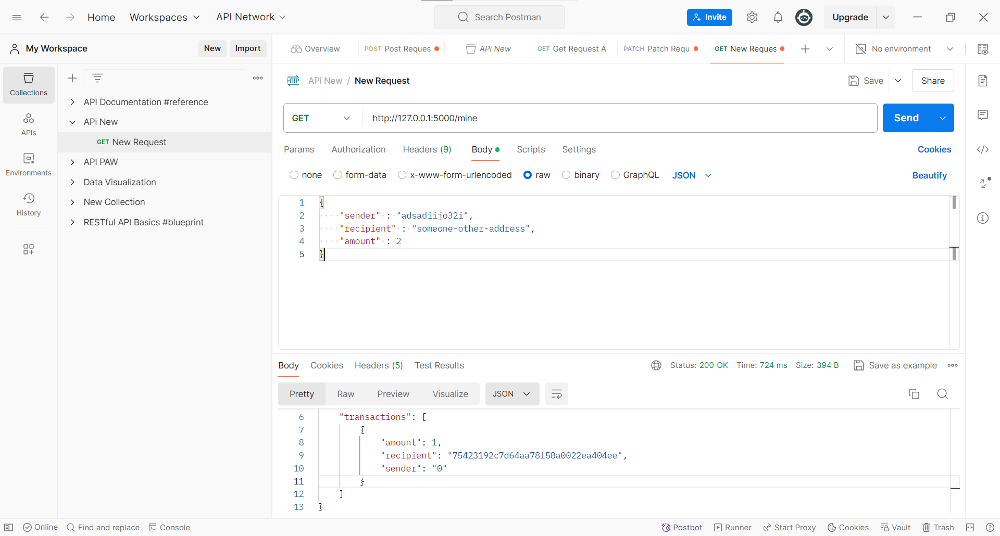
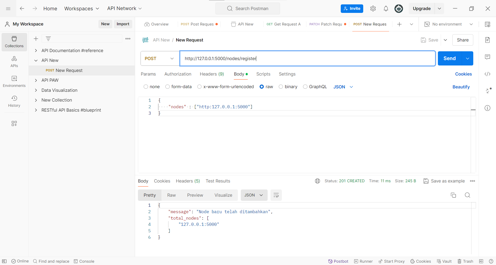
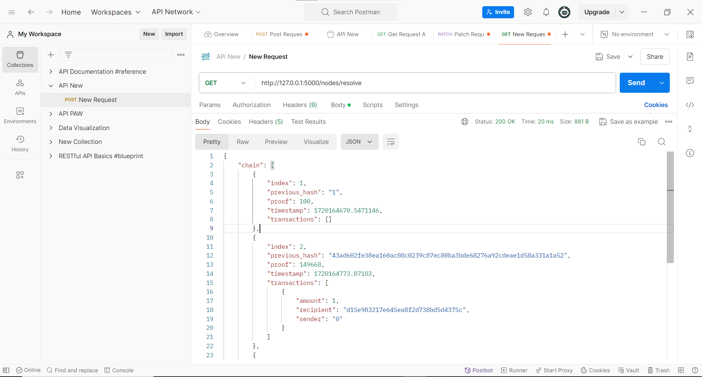

# BlockChain
**Cara tercepat untuk untuk belajar BlockChain adalah langsung dengan praktek**

Kita akan coba praktek BlockChain dengan bahasa pemrograman yang paling mudah dan paling populer, yaitu Python.

**Siap?**

Poin apa saja yang akan kita pelajari?
- [x] BlockChain
- [x] Smart Contract
- [x] BlockChain Technology
- [x] BlockChain DApps
- [x] BlockChain Consensus
- [x] BlockChain Network
- [x] BlockChain Mining
- [x] BlockChain Wallet
- [x] BlockChain Token

# BlockChain?
<details>
<summary>
    Klik Untuk Melihat Penjelasan lebih detail
</summary>

### Apa itu Blockchain?

BlockChain adalah teknologi buku besar terdistribusi dan terdesentrallisasi yang mencatat transaksi dengan cara yang aman dan transparan. Setiap blok dalam rantai berisi hash kriptografi dari blok sebelumny, stempel waktu, dan data transaksi. Struktur ini memastikan integritas dan ketidakubahan data.

### Fitur Utama Blockchain

- **Desentralisasii** : Data tidak disimpan di lokasi pusat tetapi didistribusikan di seluruh jaringan Komputer.
- **Transparansi** : Semua peserta dalam jaringan dapat melihat transaksi yang tercatat di block chain.
- **Ketidakubahan** : Setelah blok ditambahkan ke blockchain. Tidak dapat diubahh ataupun dihapus.
- **Keamanan** : Penggunaan hash Kriptografi dan mekanisme konsensus membuat BlockChain sangat aman terhadap manipulasi dan penipuan.

### Bagaimana Blockchain Bekerja ?
- **Transaksi** : Pengguna memulai transaksi.
- **Verifikasi** : Transaksi diverifikasi oleh peserta jaringan.
- **Pembuatan Blok** : Setelah diverifikasi, transaksi dikelompokkan dengan transaksi lain ke dalam blok.
- **Konsensus** : Jaringan mencapai konsensus tentang validitas blok.
- **Penambahan Rantai** : Blok ditambahkan ke blockchain, dan transaksi tercatat secara permanen.

### Jenis Blockchain
- **Blockchain Publik** : Terbuka untuk semua orang, tanpa batasan siapa yang dapat berpartisipasi.
- **Blockchain Pribadi** : Terbatas untuk  sekelompok peserta tertentu.
- **Blockchain Konsorsium** : Model hibrida di mana sekelompook organisasi mengontrol jaringan.

### Kasus Penggunaan Blockchain
- **Kriptokurensi** : Bitcoin, Ethereum,  dll.
- **Manajemen Rantai Pasokan** : Pelacakan barang dari asal ke tujuan.
- **Verifikasi Identitas** : Manajemen identitas yang aman dan terdesentralisasi.
- **Sistem Pemungutan Suara** : Proses pemungutan suara yang aman dan transparan.
- **Kontrak Cerdas** : Eksekusi otomatis kontrak berdasarkan kondisi yang telah ditentukan.

### Link untuk lebih detail tentang Crpyto
- [Dokumentasi Python Resmi](https://docs.python.org/3/)
- [Dokumentasi Ethereum](https://ethereum.org/en/developers/docs/)
- [Blockchain di Berkeley](https://blockchain.berkeley.edu/)
- [Kursus Blockchain di Coursera](https://www.coursera.org/courses?query=blockchain)

</details>
<br>

# Let's Start !!

<details>
<summary>
    Klik Untuk Melihat Penjelasan lebih detail
</summary>

<br>

Sebelum itu aku ingin kalian untuk menginstall beberapa library python terlebih dahulu

``pip install Flask `` dan ``pip install requests ``,
``pip install hashlib`` ini dapat kalian install melalui command prompt jika kalian sudah selesai menginstall libraryny, maari kita mulai


## Step 1. Membangun Blockchain

<p>Buka text editor ataupun IDE yang kalian suka, Disini saya memakai Visual Studio Code (VSCode), Buat file baru dengan nama </p>

```blockchain.py``` 

### Perwakilan tentang Blockchain

Kita akan membuat sebuah **Blockchain** class yang konstruktorny membuat daftar kosong awal (untuk menyimpan blockchain) dan kelas lainnya untuk menyimpan transaksi, 
Ini adalah kodingan blueprint untuk class ``blockchain.py`` <br>

```python
class Blockchain(object):
    def __init__(self):
        self.chain = []
        self.current_transactions = []
        
    def new_block(self):
        # Menambahkan sebuah blok baru dan menambahkanny ke rantai
        pass
    
    def new_transaction(self):
        # Menambahkan beberapa transaksi baru ke list transaksi
        pass
    
    @staticmethod
    def hash(block):
        # Hashes a Block
        pass

    @property
    def last_block(self):
        # Returns the last Block in the chain
        pass
```

``Blockchain``
class bertanggung jawab untuk mengontrol rantai, dimana akan menyimpan transaksi dan beberapa metode untuk menambahkan blok baru ke rantai, 

**Seperti apa block itu terlihat sih?**

<p>Setiap blok memiliki indeks, stempel waktu, daftar transaksi , bukti, dan hash dari blok sebelumnya. Berikut ini contoh tampilan satu blok : </p>


```bash
block = {
    'index': 1,
    'timestamp': 1506057125.900785,
    'transactions': [
        {
            'sender': "8527147fe1f5426f9dd545de4b27ee00",
            'recipient': "a77f5cdfa2934df3954a5c7c7da5df1f",
            'amount': 5,
        }
    ],
    'proof': 324984774000,
    'previous_hash': "2cf24dba5fb0a30e26e83b2ac5b9e29e1b161e5c1fa7425e73043362938b9824"
}
```
Pada titik ini, gagasan tentang rantai seharusnya sudah jelas setiap blok baru berisi hash dari blok sebelumny. **Hal ini penting karena hal inilah yang membuat blockchain tidak dapat diubah. :** Jika penyerang merusak Blok sebelumny dalam rantai, maka semua blok berikutnya akan berisi hash yang salah. jadi blockchain tidak dapat diubah.

*Apakah ini masuk akal? jika tidak silahkan untuk kalian pahamin dulu mksduny ide inti dari sistem blockchain ini.*

Kita memerlukan cara untuk menambahkan transaksi ke blok.

``new_transaction()`` method bertanggung jawab untuk hal ini, dan itu cukup mudah

```python
class Blockchain(object):
    ...
    
    def new_transaction(self, sender, recipient, amount):
        """
        Membuat transaksi baru untuk masuk ke blok tambang berikutnya
        :param sender: <str> Alamat Pengirim
        :param recipient: <str> Alamat Penerima
        :param amount: <int> Jumlah
        :return: <int> Indeks blok yang akan menampung transaksi ini
        """

        self.current_transactions.append({
            'sender': sender,
            'recipient': recipient,
            'amount': amount,
        })

        return self.last_block['index'] + 1
```
Setelah ``new_transaction()`` menambahkan transaksi ke dalam daftar, fungsi ini akan mengembalikan indeks blok tempat transaksi akan ditambahkan - yang berikutnya akan ditambang. dan ini akan berguna nantinya , bagi pengguna yang mengirimkan transaksi

### Membuat block baru
Ketika ``Blockchain`` sudah dipakai, kita perlu menyamainya dengan blok genesis - blok tanpa pendahulunya. Kita juga perlu menambahkan bukti ke blok genesis kita yang merupakan hasil penmabangan (atau bukti kerja). Kita akan jelaskan lebih detail lagi nanti

Selain membuat blok genesis di konstruktor , kita juga akan menyempurnakan metodenya.
``new block`` ``new_transaction`` dan ``hash()``

```python
import hashlib
import json
from time import time


class Blockchain(object):
    def __init__(self):
        self.current_transactions = []
        self.chain = []

        # MemBuat Blok Genesis
        self.new_block(previous_hash=1, proof=100)

    def new_block(self, proof, previous_hash=None):
        """
        Buat blok baru di blockchain
        :param proof: <int> Bukti yang diberikan oleh Bukti Algoritma Kerja
        :param previous_hash: (Optional) <str> Hash dari blok sebelumnya
        :return: <dict> Block baru
        """

        block = {
            'index': len(self.chain) + 1,
            'timestamp': time(),
            'transactions': self.current_transactions,
            'proof': proof,
            'previous_hash': previous_hash or self.hash(self.chain[-1]),
        }

        # Menyetel ulang daftar transaksi saat ini
        self.current_transactions = []

        self.chain.append(block)
        return block

    def new_transaction(self, sender, recipient, amount):
        """
        Membuat transaksi baru untuk masuk ke blok tambang berikutnya
        :param sender: <str> Alamat Pengirim
        :param recipient: <str> Alamat Penerima
        :param amount: <int> Jumlah
        :return: <int> Indeks blok yang akan menampung transaksi ini
        """
        self.current_transactions.append({
            'sender': sender,
            'recipient': recipient,
            'amount': amount,
        })

        return self.last_block['index'] + 1

    @property
    def last_block(self):
        return self.chain[-1]

    @staticmethod
    def hash(block):
        """
        Membuat hash SHA-256 dari satu blok
        :param block: <dict> Block
        :return: <str>
        """

        # Kita harus memastikan bahwa kamus itu dipesan, atau kita akan memiliki hash yang tidak konsisten
        block_string = json.dumps(block, sort_keys=True).encode()
        return hashlib.sha256(block_string).hexdigest()
```


Kode di atas adalah metode ``new_transaction`` dalam kelas ``Blockchain``. Metode ini digunakan untuk membuat transaksi baru yang akan dimasukkan ke dalam blok berikutnya yang akan ditambang

### Memahami Bukti Pekerjaan

Algoritma kerja bukti adalah bagaimana blok baru dibuat atau ditambang di blockchain tujuan POW adalah untuk menemukan angka yang memecahkan masalah.Jumlahnya harus sulit ditemukan tetapi mudah diverifikasi oleh siapa pun di netwowrk.Ini adalah ide inti di balik bukti kerja.

Mari kita putuskan bahwa hash dari beberapa integer x dikalikan dengan y lain harus berakhir dengan 0.
``hash(x * y) = ac23dc...0`` dan ini untuk Dan untuk contoh yang disederhanakan ini, mari kita perbaiki
``x = 5``. Implementasikan ini di Python : 

```python
from hashlib import sha256
x = 5
y = 0  #Kita belum tahu apa yang seharusnya ...
while sha256(f'{x*y}'.encode()).hexdigest()[-1] != "0":
    y += 1
print(f'The solution is y = {y}')

```
The solution here is ``y=21`` . Karena, hash yang diproduksi berakhir di 0: 
```
hash(5 * 21) = 1253e9373e...5e3600155e860
```

Dalam Bitcoin, Algoritma Bukti Kerja disebut Hashcash. Dan itu tidak terlalu berbeda dari contoh dasar kita di atas. Ini adalah algoritma yang harus dipecahkan oleh penambang untuk membuat blok baru.Secara umum, kesulitan ditentukan oleh jumlah karakter yang dicari dalam string.Para penambang kemudian dihargai atas solusi mereka dengan menerima koin - dalam transaksi.

Jaringan dapat dengan mudah memverifikasi solusinya.

**Menerapkan bukti dasar kerja**

Mari kita terapkan algoritma serupa untuk blockchain kita .Aturan yang akan kita buat mirip dengan contoh di atas:


```python
import hashlib
import json

from time import time
from uuid import uuid4


class Blockchain(object):
    ...
        
    def proof_of_work(self, last_proof):
        """
        Bukti sederhana dari algoritma kerja:
        - Menemukan sebuah angka  p' sedemikian rupa seperti (pp ') berisi 4 nol terkemuka, di mana p adalah p sebelumnya
         - P adalah bukti sebelumnya, dan p' adalah proo baruf
        :param last_proof: <int>
        :return: <int>
        """

        proof = 0
        while self.valid_proof(last_proof, proof) is False:
            proof += 1

        return proof

    @staticmethod
    def valid_proof(last_proof, proof):
        """
        Memvalidasi bukti: apakah hash (last_proof, bukti) berisi 4 nol terkemuka?
        :param last_proof: <int> Bukti sebelumny
        :param proof: <int> Bukti Setelahny
        :return: <bool> Benar jika benar, salah jika tidak.
        """

        guess = f'{last_proof}{proof}'.encode()
        guess_hash = hashlib.sha256(guess).hexdigest()
        return guess_hash[:4] == "0000"
```

Untuk menyesuaikan kesulitan algoritma, kita dapat memodifikasi jumlah nol terkemuka.Tapi 4 sudah cukup.Anda akan mengetahui bahwa penambahan nol tunggal tunggal membuat perbedaan besar pada waktu yang diperlukan untuk menemukan solusi.

Kelas kita hampir lengkap dan kita siap untuk mulai berinteraksi dengan itu menggunakan permintaan HTTP.

## Step 2: Blockhain sebagai sebuah API

Kita akan membuat tiga metode:
- /transaction/new : untuk membuat transaksi baru ke dalam blok
- /mine : untuk memberi tahu server kita untuk menambang blok baru.
- /chain : untuk mengembalikan nilai blockchain penuh

### Menyetting Flask

**"Server"** Kita akan membentuk satu node di jaringan blockchain ktia .Mari kita buat beberapa kode boilerplate

```python
import hashlib
import json
from textwrap import dedent
from time import time
from uuid import uuid4

from flask import Flask


class Blockchain(object):
    ...


# Instantiate Node kita
app = Flask(__name__)

# Hasilkan alamat unik global untuk node ini
node_identifier = str(uuid4()).replace('-', '')

# Instantiate blockchain
blockchain = Blockchain()


@app.route('/mine', methods=['GET'])
def mine():
    return "We'll mine a new Block"
  
@app.route('/transactions/new', methods=['POST'])
def new_transaction():
    return "We'll add a new transaction"

@app.route('/chain', methods=['GET'])
def full_chain():
    response = {
        'chain': blockchain.chain,
        'length': len(blockchain.chain),
    }
    return jsonify(response), 200

if __name__ == '__main__':
    app.run(host='0.0.0.0', port=5000)
```
Penjelasan singkat tentang apa yang telah kita tambahkan di atas:

Baris 15: Instantiates Node Kita.
Baris 18: Buat nama acak untuk simpul kita.
Baris 21: instantiate 

### Titik akhir transaksi

Seperti inilah permintaan transaksi nantinya. Itu yang dikirim pengguna ke server:

```json
{
 "sender": "my address",
 "recipient": "someone else's address",
 "amount": 5
}
```
Karena kita sudah memiliki metode kelas kita untuk menambahkan transaksi ke blok, sisanya mudah.Mari kita tulis fungsi untuk menambahkan transaksi:

```python
import hashlib
import json
from textwrap import dedent
from time import time
from uuid import uuid4

from flask import Flask, jsonify, request

...

@app.route('/transactions/new', methods=['POST'])
def new_transaction():
    values = request.get_json()

    # Periksa apakah bidang yang diperlukan ada di data postingan
    required = ['sender', 'recipient', 'amount']
    if not all(k in values for k in required):
        return 'Missing values', 400

    # Buat transaksi baru
    index = blockchain.new_transaction(values['sender'], values['recipient'], values['amount'])

    response = {'message': f'Transaction will be added to Block {index}'}
    return jsonify(response), 201
```
*(A method for creating Transactions)*

### Titik akhir penambangan
Titik akhir pertambangan kita adalah tempat keajaiban terjadi.Dan itu mudah. Itu harus melakukan tiga hal:

- Hitung bukti pekerjaan
- Hadiah penambang (AS) dengan menambahkan transaksi yang memberi penambang 1 koin
- Buat blok baru dengan menambahkannya ke rantai

```python
import hashlib
import json

from time import time
from uuid import uuid4

from flask import Flask, jsonify, request
...
@app.route('/mine', methods=['GET'])
def mine():
    # We run the proof of work algorithm to get the next proof...
    last_block = blockchain.last_block
    last_proof = last_block['proof']
    proof = blockchain.proof_of_work(last_proof)

    # We must receive a reward for finding the proof.
    # The sender is "0" to signify that this node has mined a new coin.
    blockchain.new_transaction(
        sender="0",
        recipient=node_identifier,
        amount=1,
    )

    # Forge the new Block by adding it to the chain
    previous_hash = blockchain.hash(last_block)
    block = blockchain.new_block(proof, previous_hash)

    response = {
        'message': "New Block Forged",
        'index': block['index'],
        'transactions': block['transactions'],
        'proof': block['proof'],
        'previous_hash': block['previous_hash'],
    }
    return jsonify(response), 200
```
Perhatikan bahwa penerima blok yang ditambang adalah alamat simpul kita.Dan sebagian besar dari apa yang telah kita lakukan di sini adalah berinteraksi dengan metode di kelas blockchain kita.Pada titik ini, kita selesai, dan dapat mulai berinteraksi dengan blockchain kita

## Step 3 : Berinteraksi dengan blockchain yang telah kita buat

Anda dapat menggunakan CURL atau POSTMAN tua untuk berinteraksi dengan API kita melalui jaringan

Menyalakan server.

```python
python blockchain.py
- Running on http://127.0.0.1:5000/
- And Ctrl + C untuk keluar
```

Struktur Transaksi : 


Jika kalian tidak memakai Postman, maka kamu bisa gunakan request dengan cURL:

```bash
$ curl -X POST -H "Content-Type: application/json" -d '{
 "sender": "d4ee26eee15148ee92c6cd394edd974e",
 "recipient": "someone-other-address",
 "amount": 5
}' "http://localhost:5000/transactions/new"
```

## Step 4 : Konsensus
Kalian sangat keren, kita sudah memiliki blockchain dasar yang menerima transaksi dan kita untuk menambang blok baru, 
Tetapi seluruh titik blockchain adalah bahwa mereka harus didesentralisasi.Dan mereka terdesentralisasi, bagaimana bisa kita memastikan bahwa mereka semua mencerminkan rantai yang sama?Ini disebut masalah konsensus, dan kita harus melibatkan algoritma konsensus jika kita menginginkan lebih dari satu node di jaringan kita.

### Registering new Nodes
Before we can implement a Consensus Algorithm, we need a way to let a node how about neighbouring nodes on the network. 

<summary>

- nodes/registe

</summary>

Untuk menerima daftar node baru dalam formulir

Untuk mengimplementasikan algoritma konsensus kita, yang menyelesaikan konflik - untuk memastikan sebuah node memiliki rantai yang benar.Kita perlu memodifikasi blok kita

```python
...
from urllib.parse import urlparse
...


class Blockchain(object):
    def __init__(self):
        ...
        self.nodes = set()
        ...

    def register_node(self, address):
        """
        Add a new node to the list of nodes
        :param address: <str> Address of node. Eg. 'http://192.168.0.5:5000'
        :return: None
        """

        parsed_url = urlparse(address)
        self.nodes.add(parsed_url.netloc)
```

*(A Method for adding neighbouring nodes our network)*

Note that we've used a 

```
set()
```

untuk memegang daftar node.Ini adalah cara murah untuk memastikan bahwa penambahan node baru adalah idempoten - artinya tidak peduli berapa kali kita menambahkan node tertentu, tampaknya persis satu.

### Menerapkan algoritma konsensus

Seperti yang disebutkan, konflik adalah ketika satu node memiliki rantai yang berbeda dengan simpul lain.Untuk menyelesaikan ini, kita akan membuat aturan bahwa rantai *valid terpanjang adalah otoritatif *.Dengan kata lain, rantai terpanjang di jaringan adalah * de-facto * satu.Menggunakan algoritma ini, kita mencapai * konsensus * di antara node -node di jaringan kita.

```python
import requests


class Blockchain(object)
    ...
    
    def valid_chain(self, chain):
        """
        Determine if a given blockchain is valid
        :param chain: <list> A blockchain
        :return: <bool> True if valid, False if not
        """

        last_block = chain[0]
        current_index = 1

        while current_index < len(chain):
            block = chain[current_index]
            print(f'{last_block}')
            print(f'{block}')
            print("\n-----------\n")
            # Check that the hash of the block is correct
            if block['previous_hash'] != self.hash(last_block):
                return False

            # Check that the Proof of Work is correct
            if not self.valid_proof(last_block['proof'], block['proof']):
                return False

            last_block = block
            current_index += 1

        return True

    def resolve_conflicts(self):
        """
        This is our Consensus Algorithm, it resolves conflicts
        by replacing our chain with the longest one in the network.
        :return: <bool> True if our chain was replaced, False if not
        """

        neighbours = self.nodes
        new_chain = None

        # We're only looking for chains longer than ours
        max_length = len(self.chain)

        # Grab and verify the chains from all the nodes in our network
        for node in neighbours:
            response = requests.get(f'http://{node}/chain')

            if response.status_code == 200:
                length = response.json()['length']
                chain = response.json()['chain']

                # Check if the length is longer and the chain is valid
                if length > max_length and self.valid_chain(chain):
                    max_length = length
                    new_chain = chain

        # Replace our chain if we discovered a new, valid chain longer than ours
        if new_chain:
            self.chain = new_chain
            return True

        return False
```
The first method, 

```python
valid_chain()
```

bertanggung jawab untuk memeriksa apakah rantai valid dengan melingkarkan melalui setiap blok dan memverifikasi hash dan buktinya.

```python
resolve_conflict()
```

adalah metode yang melingkar melalui semua node tetangga kita, mengunduh rantai mereka dan memverifikasi mereka menggunakan metode di atas. 

Mari kita daftarkan dua titik akhir ke API kita, satu untuk menambahkan node tetangga dan yang lainnya untuk menyelesaikan konflik.


```python
@app.route('/nodes/register', methods=['POST'])
def register_nodes():
    values = request.get_json()

    nodes = values.get('nodes')
    if nodes is None:
        return "Error: Please supply a valid list of nodes", 400

    for node in nodes:
        blockchain.register_node(node)

    response = {
        'message': 'New nodes have been added',
        'total_nodes': list(blockchain.nodes),
    }
    return jsonify(response), 201


@app.route('/nodes/resolve', methods=['GET'])
def consensus():
    replaced = blockchain.resolve_conflicts()

    if replaced:
        response = {
            'message': 'Our chain was replaced',
            'new_chain': blockchain.chain
        }
    else:
        response = {
            'message': 'Our chain is authoritative',
            'chain': blockchain.chain
        }

    return jsonify(response), 200
```

Pada titik ini Kalian dapat mengambil mesin yang berbeda jika kalian suka, dan memutar node yang berbeda di jaringan kalian.Atau proses putaran menggunakan port yang berbeda pada mesin yang sama.Saya memutar simpul lain di mesin saya, pada port yang berbeda, dan mendaftarkannya dengan simpul saya saat ini, dengan demikian.Kami memiliki dua node :

```bash
http://localhost:5000 # Di perangkat yang berbeda juga bisa berbeda
```

and 

```bash
http://localhost:5001 # Di perangkat yang berbeda juga bisa berbeda alamat nya
```



*(Mendaftarkan simpul baru)*

Aku kemudian menambang beberapa blok baru di simpul 2, untuk memastikan rantai lebih panjang, setelah itu, kami menelepon


```bash
GET / Nodes / resolve
```

Pada simpul 1, di mana rantai digantikan oleh algoritma konsensus:



(*Algoritma konsensus di tempat kerja*)

Dan itu berhasil ... kumpulkan beberapa teman untuk membantu menguji blockchain yang kamu buat

Oke mungkin itu saja untuk Teknik dasar dari blockchain yang sangat sangat simpel , kedepanny akan aku buatkan lagi tutorial yang mungkin bermanfaat kedepanny,

Jangan lupa untuk Menambahkan beberapa start ke dalam repository github ku yaa, Oh ya kalo kalian ingin berkontribusi ke dalam project ini kalian bisa langsung menghubungkin lewat email ataupun dm IG, Terimakasih 😊
 


</details>


